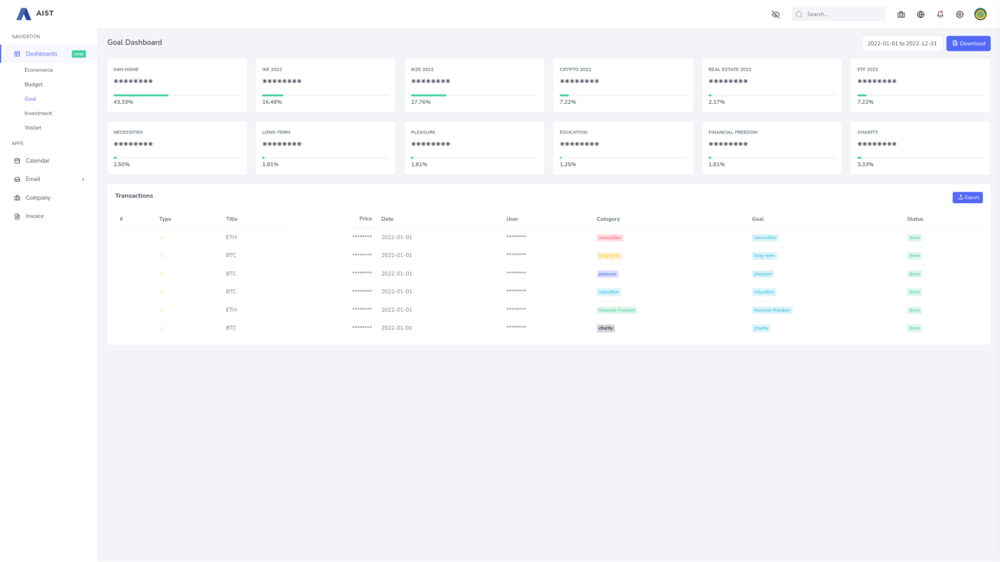

> [!TIP]
> This is an interactive profile so enjoy finding easter eggs, endorsing my skills and giving me recommendation when I least expect it.
>
> Endorsements are very easy to add and you don't really put much effort into them.
> To endorse my skills, click `Endorse me!` below (next to the skill) and then choose your reaction 👍😄🎉❤️🚀👀 under the issue.
>
> To endorse other my skills [create new issue using the template](https://github.com/ma-si/ma-si/issues/new?assignees=&labels=endorsement&template=endorsement-template.md&title=Endorse%3A+SKILL_HERE) and then pick your reaction 👍😄🎉❤️🚀👀 under the issue.
>
> To give me recommendation [create new issue using the template](https://github.com/ma-si/ma-si/issues/new?assignees=ma-si&labels=recommendation&template=recommendation-template.md&title=Recommendation) and fill the content.
>
> You can also follow me!
>
> > **Have a fun :)**
> >
> > Thank you for received endorsements, recommendations, support & following me.
>
> #### ✨ HALL OF FAME
>
> They have already endorsed my skills, recommended, supported or followed me:
>
> <!--START_SECTION:FAME--> <!--END_SECTION:FAME-->

## ➿ Process Engineer ♻️ Change Architect 💎 Quality Advocate 🧙‍♂️ Code Whisperer
<!--START_SECTION:MISSION-->
#### ❤️ MISSION

Inspiring others to share and explore knowledge in a collaborative community.
<!--END_SECTION:MISSION-->

<!--START_SECTION:VALUES-->
#### 🧠 VALUES

- __STAY CURIOUS__ _Always wonder. Always explore._
- __SPEAK WITH HEART__ _Be your true self._
- __WORK SMART__ _Think. Discuss. Design. Automate._
- __STRIVE FOR BETTER__ _Reach far. Aim high. Dream big._
- __DELIVER WITH QUALITY__ _Move fast. Do it right. Be proud._
- __LEND A HAND__ _We are all in this together._
<!--END_SECTION:VALUES-->

<!--START_SECTION:SERVICES-->
#### ⚗️ SERVICES PROVIDED

- IT Consulting
- Software Architecture
- Business Process Optimisation
- Development / API Development / Web Development / Microservice Development / Application Development / Cloud Application Development / SaaS Development / Custom Software Development
- Information Security
- Project Management
- Software Testing
- Resume Writing
- Mentoring
<!--END_SECTION:SERVICES-->

<!--START_SECTION:VOLUNTEERING-->
#### 🩸 VOLUNTEERING

- **NVC Learning Group** _Co-Host_ | _Member_ (`2022.09` - `2023.08`)
- **MENSA Poland** _Member_ (`2018.02` - `now`)
<!--END_SECTION:VOLUNTEERING-->

<!--START_SECTION:ASSESSMENTS-->
# 🏅 ASSESSMENTS

<!--END_SECTION:ASSESSMENTS-->

<!--START_SECTION:COURSES-->
# 🎓 COURSES

- __Domain Drivers__ devstyle.pl
- __Legacy Fighter__ devstyle.pl
- __DNA - Droga Nowoczesnego Architekta (The Way of the Modern Architect)__ devstyle.pl
- __Web App Security: attacking & protecting__ Niebezpiecznik PL `2017.11`
- __Algorithms II__ Princeton University on Coursera `2014.12`
- __Artificial Intelligence__ National Taiwan University on Coursera `2014.11`
- __Cryptography II__ Stanford University on Coursera `2014.11`
- __Algorithms I__ Princeton University on Coursera `2014.10`
- __Cryptography I__ Stanford University on Coursera `2014.10`
- __ZF2: Advanced Course Concepts__ Zend Technologies Ltd. `2013.11`
- __Advanced Internet Technology__ IT Media s.c. `2008.08`
- __Fundamental Internet Technology__ IT Media s.c. `2008.08`
<!--END_SECTION:COURSES-->

# ✨ SKILLS

Click badges to endorse my skills!
<!--START_SECTION:SKILLS-->
#### General

      )
#### Programming/Markup Languages

        
#### Frameworks

        
#### Tools

                                             
#### Hardware

 

<!--END_SECTION:SKILLS-->

# ✨ ENDORSEMENTS

<!--START_SECTION:ENDORSEMENTS-->
|    |    |
|:---|---:|
| **General** |    |
| [-ffffff?style=for-the-badge&logo=)](https://github.com/ma-si/ma-si/issues/35)  | [Endorse me!](https://github.com/ma-si/ma-si/issues/35) |
| [-ffffff?style=for-the-badge&logo=)](https://github.com/ma-si/ma-si/issues/55)  | [Endorse me!](https://github.com/ma-si/ma-si/issues/55) |
| [-ffffff?style=for-the-badge&logo=)](https://github.com/ma-si/ma-si/issues/54)  | [Endorse me!](https://github.com/ma-si/ma-si/issues/54) |
| [-ffffff?style=for-the-badge&logo=)](https://github.com/ma-si/ma-si/issues/new?assignees=&labels=endorsement&template=endorsement-template.md&title=Endorse%3A+Extreme_Automation)  | [Endorse me!](https://github.com/ma-si/ma-si/issues/new?assignees=&labels=endorsement&template=endorsement-template.md&title=Endorse%3A+Extreme_Automation) |
| [-_(1)-ffffff?style=for-the-badge&logo=)](https://github.com/ma-si/ma-si/issues/26)  | [Endorse me!](https://github.com/ma-si/ma-si/issues/26) |
| [-ffffff?style=for-the-badge&logo=)](https://github.com/ma-si/ma-si/issues/52)  | [Endorse me!](https://github.com/ma-si/ma-si/issues/52) |
| [-_(0)-ffffff?style=for-the-badge&logo=)](https://github.com/ma-si/ma-si/issues/new?assignees=&labels=endorsement&template=endorsement-template.md&title=Endorse%3A+Nonviolent_Communication_(NVC))  | [Endorse me!](https://github.com/ma-si/ma-si/issues/new?assignees=&labels=endorsement&template=endorsement-template.md&title=Endorse%3A+Nonviolent_Communication_(NVC)) |
| **Programming/Markup Languages** |    |
| [-777BB4?style=for-the-badge&logo=php)](https://github.com/ma-si/ma-si/issues/1)  | [Endorse me!](https://github.com/ma-si/ma-si/issues/1) |
| [-000000?style=for-the-badge&logo=Bash)]()  | [Endorse me!]() |
| [-43853d?style=for-the-badge&logo=node.js)](https://github.com/ma-si/ma-si/issues/30)  | [Endorse me!](https://github.com/ma-si/ma-si/issues/30) |
| [-007ACC?style=for-the-badge&logo=typescript)](https://github.com/ma-si/ma-si/issues/33)  | [Endorse me!](https://github.com/ma-si/ma-si/issues/33) |
| [-000000?style=for-the-badge&logo=)]()  | [Endorse me!]() |
| [-F7DF1E?style=for-the-badge&logo=JavaScript)]()  | [Endorse me!]() |
| **Frameworks** |    |
| [-000000?style=for-the-badge&logo=symfony)](https://github.com/ma-si/ma-si/issues/5)  | [Endorse me!](https://github.com/ma-si/ma-si/issues/5) |
| [-000000?style=for-the-badge&logo=express)](https://github.com/ma-si/ma-si/issues/38)  | [Endorse me!](https://github.com/ma-si/ma-si/issues/38) |
| [-68B604?style=for-the-badge&logo=zend-framework)](https://github.com/ma-si/ma-si/issues/31)  | [Endorse me!](https://github.com/ma-si/ma-si/issues/31) |
| [-DD0031?style=for-the-badge&logo=angular)](https://github.com/ma-si/ma-si/issues/3)  | [Endorse me!](https://github.com/ma-si/ma-si/issues/3) |
| **Tools** |    |
| [-46a2f1?style=for-the-badge&logo=docker)](https://github.com/ma-si/ma-si/issues/11)  | [Endorse me!](https://github.com/ma-si/ma-si/issues/11) |
| [-EE0000?style=for-the-badge&logo=ansible)](https://github.com/ma-si/ma-si/issues/2)  | [Endorse me!](https://github.com/ma-si/ma-si/issues/2) |
| [-232F3E?style=for-the-badge&logo=amazonwebservices)](https://github.com/ma-si/ma-si/issues/9)  | [Endorse me!](https://github.com/ma-si/ma-si/issues/9) |
| [-336791?style=for-the-badge&logo=postgresql)](https://github.com/ma-si/ma-si/issues/7)  | [Endorse me!](https://github.com/ma-si/ma-si/issues/7) |
| [-4479A1?style=for-the-badge&logo=mysql)](https://github.com/ma-si/ma-si/issues/23)  | [Endorse me!](https://github.com/ma-si/ma-si/issues/23) |
| [-03a9f4?style=for-the-badge&logo=home-assistant)](https://github.com/ma-si/ma-si/issues/61)  | [Endorse me!](https://github.com/ma-si/ma-si/issues/61) |
| **Hardware** |    |

<!--END_SECTION:ENDORSEMENTS-->

[Endorse new skill!](https://github.com/ma-si/ma-si/issues/new?assignees=&labels=endorsement&template=endorsement-template.md&title=Endorse%3A+SKILL_HERE)

> [!TIP]
> To join Hall of Fame of my endorsers - click `Endorse me!` above (next to the skill) and then choose your reaction 👍😄🎉❤️🚀👀 under the issue.
>
> To endorse other my skills [create new issue using the template](https://github.com/ma-si/ma-si/issues/new?assignees=&labels=endorsement&template=endorsement-template.md&title=Endorse%3A+SKILL_HERE) and then pick your reaction 👍😄🎉❤️🚀👀 under the issue.
>
> > **Have a fun :)**
> >
> > Thank you for your endorsements.

# ⭐ RECOMMENDATIONS

<!--START_SECTION:RECOMMENDATIONS-->
> This is just an example recommendation given on the GitHub.
>
> Feel free to give me your own recommendation that will be visible in the [⭐ RECOMMENDATIONS](https://github.com/ma-si#-recommendations) section :)
>
>  ma-si
<!--END_SECTION:RECOMMENDATIONS-->

> Mateusz is a very contact and organized person. We worked together on various IT projects. During our cooperation, I have always been able to count on Mateusz's commitment and support. I appreciate his willingness to continuously improve and open up to new ideas.
>
> -- Agnieszka | HR Specialist Recruiter

> Mateusz is a great and supportive specialist. He knows how to speak with non-developers about development challenges, so it's easy to understand and make a decision. He is based on his technical experience, but also has good aesthetic taste. Full of initiative and engaged. It was a pleasure to work with Mateusz on building my law firm’s website. I am going to be back for its update.
>
> -- Natalia | Legal Counsel HR & Compliance

> Mateusz is a really responsible and talented developer. I was very pleased to work with him also because of affability and readiness to help as soon as possible. I highly recommend him!
>
> -- Anna | Web/Front-End UI Developer/Engineer

> Mateusz is very experienced and helpful specialists who are good to have on your side.
>
> -- Mariusz | Product Owner & Innovation Facilitator, Agile IT Manager

> Working with Mateusz has been a very pleasant experience. Mateusz has very good PHP knowledge, he's very propositive, and he was able to integrate with the existing team without any problem. He was able to start working on existing projects in almost no time and with just the basic background information. He's been of great help to the whole team and I hope we will be able to work together again in the future.
>
> -- Lorenzo | IT Consultant, PHP Developer, GNU/Linux SysAdmin

> I have worked with Mateusz for more than 6 months on an interesting yet very demanding pan-european project which needed full scale programmers such as Mateusz. Mateusz is very autonomous, hard working, always delivers what was agreed. His multitasking skills covering the most important programming languages helped the project to accelerate far beyond expectations. Mateusz is a team player and very enthusiastic about the job he has committed for. I do not hesitate to give Mateusz my best recommendations.
>
> -- Maciej | CEO, Managing Director

> Mateusz is a responsible and conscientious person. He involves in entrusted tasks - not only performs the duties, but also proposes new solutions that he successfully implements. He is characterized by openness and high awareness in the field of Open Source solutions improving the programmer's workshop.
>
> -- Paweł | CTO

> Very creative and open-minded to a new technologies man. He learns quickly and is not afraid of challenges. Very good first found in teamwork. This is not just a typical programmer, as well as creative designer-engineer with a sense of graphics.
>
> -- Marcin | IT Project Manager

[You can give me your own recommendation!](https://github.com/ma-si/ma-si/issues/new?assignees=ma-si&labels=recommendation&template=recommendation-template.md&title=Recommendation)

> [!TIP]
> To join Hall of Fame of my recommenders - [create new issue using the template](https://github.com/ma-si/ma-si/issues/new?assignees=ma-si&labels=recommendation&template=recommendation-template.md&title=Recommendation) and fill the content.
>
> > **Have a fun :)**
> >
> > Thank you for received recommendations.

<!--START_SECTION:PROJECTS-->
# 🚀 PROJECTS

## S..W.... | International Logistics Company

_Improvement Evangelist_ | _Senior Software Engineer_ (`2022.03`-`now`)

- Designing & programming microservices

`PHP 8.3` `Symfony` `Docker` `IaC` `Ansible`

## H.....io | AIST Smart Technologies

_Project Manager_ | _Software Architect_ | _DevOps Engineer_ (``-`now`)

Applicant tracking system (ATS).
Application that enables the electronic handling of recruitment and hiring needs.
CRM application for managing recruitment processes & maintaining professional contacts.

- Designing & programming microservices

`PHP 8` `Mezzio` `Node` `Angular` `ElasticSearch` `RabbitMQ` `Docker` `IaC` `Ansible` `AWS` `CI/CD`

## P.......W.....M...... | AIST Smart Technologies

_Project Manager_ | _Software Architect_ | _DevOps Engineer_ (`2021.09`-`now`)

Application for managing investment portfolios.

- Angular client development
- API development
- External APIs integration
- Signals & automation

`PHP 8` `Node` `Angular 12` `Queue Communication` `Docker` `Web Sockets`
###### Budget module

Budget Module & API microservice

###### Goal Module

Goal Module & API microservice

###### Investment Module

Investment Module & API microservice

## P......M...... | AIST Smart Technologies

_Project Manager_ | _Software Architect_ | _DevOps Engineer_ (`2021.09`-`now`)

Project management and automation software for managers, freelancers & programmers.

- Angular client development
- API development

`PHP 8` `Node` `Angular 12` `Queue Communication` `Docker`

## T...M...... | AIST Smart Technologies

_Project Manager_ | _Software Architect_ | _DevOps Engineer_ (`2021.09`-`now`)

Task management and automation software for Scrum & Kanban boards.

- Angular client development
- API development

`PHP 8` `Node` `Angular 12` `Queue Communication` `Docker`

## A.........M...... | AIST Smart Technologies

_Project Manager_ | _Software Architect_ | _DevOps Engineer_ (`2021.09`-`now`)

Onboarding and automation software for accountants & payroll businesses.

- Angular client development
- API development

`PHP 8` `Node` `Angular 12` `Queue Communication` `Docker`

## <a href="https://github.com/ma-si/ma-si">Interactive GitHub Portfolio</a> | me

_Improvement Evangelist_ | _Senior Software Engineer_ (`2020.08`-`now`)

- Creating GitHub actions
- Creating Discord notifications
- JS Programming
- Ansible automation

`GitHub Actions` `Ansible` `JavaScript`

## LegalMetrics | Publishing Company

_Contract Software Developer_ (`2020.07`-`2021.12`)

Quotes of copyrighted content require the accumulation of the compensation-for-use reserve. Application algorithms calculates reserves for content creators and basic copyright holders based on metrics.

- Angular client development
- API development

`PHP 8` `Angular 8` `Symfony` `Redis` `Docker` `CLI` `RabbitMQ` `Elastic Search` `Jenkins` `OpenAPI`

## S..D......... | Insurance Broker

_Contract DevOps Engineer_ | _Senior Software Developer_ (`2020.01`-`2020.03`)

- Setting up CI/CD & Azure
- Designing & developing Node microservices
- Developing React client

`Node` `React` `TypeScript` `Docker` `IaC` `Azure`

## A...F.... | Automotive Insurance Company

_Contract Senior Developer_ (`2019.05`-`2019.12`)

Fraud detection system

- Setting up CI/CD & AWS
- API client development & CLI consumer

`Symfony` `CLI` `GraphQL` `API` `Queue` `AWS`

## <a href="https://jobstoday.world/en/">jobstoday.world</a> | JobsToday

_Contract DevOps Engineer_ | _Software Architect_ | _Team Leader_ (`2017.09`-`2018.08`)

Leader in innovative & cost-effective eRecruitment Platform in Switzerland, Germany, Poland & Austria.

- Code review of an existing source
- Security audit & report
- Redesigning architecture
- Code refactoring
- Separate API Architecture
- Performance optimization
- ElasticSearch implementation
- Redis Implementation
- Organizing & automating dev environment and deployment
- Manage deployment of version 2
- PayPal & Stripe payments implementation
- Google Maps API integration for the search location
- Internationalization & translation implementation
- Currency exchange rates API integration
- Geolocation implementation
- Affiliate Marketing implementation for HR clients
- Conducting technical recruitment of Zend Framework 2&3 specialists

`PHP 7` `Zend Framework 2` `Zend Framework 3` `Docker` `Redis` `ElasticSearch` `Pug` `Gulp`
###### Full text search

New architecture with full text search integrated

## V..M..... | Telecommunications Company

_Contract Software Architect_ | _Team Leader_ | _Senior Software Developer_ (`2017.03`-`2017.10`)

System that includes client data in order to deliver personalized messages for dynamic videos. Clients are big companies who want to engage in a discussion with their final clients through an innovative media like personalized videos.

- Code review
- Software architecture
- Performance optimization
- Security inspection
- JWT Auth (JSON Web Tokens) integration

`PHP 7` `Zend Expressive 2` `Docker` `Redis` `CLI` `JWT`

## <a href="carplanner.com">carplanner.com</a> | DAICAR POLSKA Sp z o.o.

_Contract Senior Software Developer_ (`2016.05`-`2017.01`)

Automotive digital retail platform with a mission to ease and transform the way people select, buy and use cars.

- Creating module architecture in ZF3 and Zend Expressive
- Designing API architecture for contractors
- RabbitMQ implementation
- External APIs integration
- Architecture design of the landing page generation engine
- Internationalization implementation
- Code review

`PHP 7` `Zend Framework 3` `Zend Expressive` `RabbitMQ` `Docker` `Postgres` `MySQL` `Amazon S3`
###### Landing Page Engine

__Landing Page Engine__ 2016.12 - 2017.01

###### Vehicle Comparison Engine

__Vehicle Comparison Engine__

###### Vehicle Search Engine

__Vehicle Search Engine__

## Lead Manager | DAICAR POLSKA Sp z o.o.

_Contract Senior Software Developer_ (`2016.11`-`2017.01`)

CRM solution that enables to capture leads, manage their purchase pipelines and retain customers.

## <a href="https://audioteka.com">audioteka.com</a> | Audioteka S.A.

_Senior PHP Programmer_ (`2015.09`-`2016.03`)

- Development of the new site deployed on March 9, 2016
- Subscription & voucher implementation
- Anti "Dog Pile Effect" solution implementation

`PHP 5.6` `Symfony 2`

## <a href="https://gowork.pl">gowork.pl</a> | GoWork Serwis Pracy

_Contract Symfony Developer_ | _PHP Programmer_ (`2015.03`-`2015.08`)

- Employment & Training Platform development
- Code refactoring, unit testing

`PHP 5.6` `Symfony 2` `MariaDB` `PhpUnit` `Solr` `Docker`

## <a href="https://akademiq.pl">akademiq.pl</a> | Altkom Akademia S.A.

_Contract Zend Framework 2 Developer_ | _Tech Leader_ | _Head Developer_ (`2013.05`-`2015.02`)

- Development of an Educational Platform
- Technical leader, Head Developer in Zend Framework Projects

`PHP 5` `Zend Framework 2` `Postgres` `MySQL`

## <a href="https://www.t-matic.com.pl/oferta/smart-control#item-1">TiMS - Smart telematics for business</a> | T-matic Systems S.A.

_Contract Business Application Developer_ (`2012.11`-`2013.04`)

- Git & PHPUnit implementation
- Stash integration and Git Hooks settings
- Development & maintenance of a telematics application

`PHP 5` `GIT` `PhpUnit`

## Knowledge Base System | IDEA EXPERT S.A.

_Senior PHP Programmer_ | _Business Application Designer_ | _Head ZF2 Developer_ (`2012.10`-`2012.10`)

- Introduction & implementation of new technologies (GIT, Composer, Zend Framework 2)

`PHP 5` `GIT` `Zend Framework 2` `Composer` `PostgreSQL`

## CRM System | Noble Bank S.A.

_Senior PHP Programmer_ (`2011.08`-`2012.10`)

- CRM systems development
- CRM systems integration
- MemcacheD implementation
- PHPWord implementation

`PHP 5` `PostgreSQL` `Memcached` `Smarty` `Bootstrap 3` `jQuery`

## Assessment Platform | Home Broker S.A.

_PHP Programmer_ (`2011.08`-`2012.09`)

- Development

`PHP 4` `PostgreSQL`

## Promotion Management System | Open Finance S.A.

_PHP Programmer_ (`2011.10`-`2012.07`)

- Promotion system development

`PHP 4` `PostgreSQL` `jQuery`

## Warehouse Management System (WMS) | Idea Bank S.A.

_PHP Programmer_ (`2011.08`-`2011.09`)

- Programming of a system supervising the orders

`PHP 4` `PostgreSQL`

## recenzje.com | Dotpay S.A.

_PHP Programmer_ | _Web Developer_ (`2005.11`-`2008.02`)

- Implementation of an Internet Payment System - AllPay

`PHP` `MySQL`

## Warehouse Management System (WMS) | District Court for Mokotów, Warsaw

_Warehouseman in the Administration Dept. / Trade Dept._ (`2005.11`-`2008.02`)

- Programming and implementation of a system that enables to efficiently supervise the orders & administration of the resources.

`PHP` `MySQL`

<!--END_SECTION:PROJECTS-->
